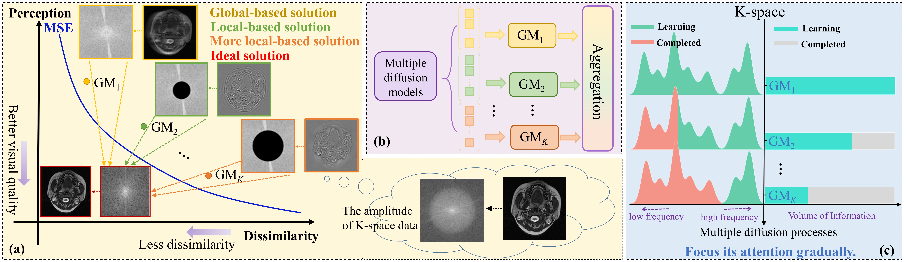
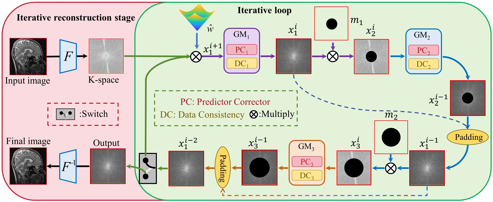

# DP-MDM

**paper**: [DP-MDM: Detail-Preserving MR Reconstruction via Multiple Diffusion Models](https://arxiv.org/abs/2405.05763)

**Authors**: Mengxiao Geng, Jiahao Zhu, Ran Hong, Qiqing Liu, Dong Liang, Qiegen Liu*


Date: Feb. 20, 2025

The code and the algorithm are for non-commercial use only. 

Copyright 2025, School of Information Engineering, Nanchang University.

----

Magnetic resonance imaging (MRI) plays a critical role in medical diagnosis and treatment by capturing detailed features that reveal subtle changes, which can challenge clinicians in making accurate assessments. However, the widely utilized single diffusion model has limitations, as it fails to accurately capture more intricate details. In this work, we propose a detail-preserving reconstruction method that leverages multiple diffusion models to extract structural and detailed features in the k-space domain, rather than the image domain. Since frequency information in the k-space is more regularly distributed than in the image domain, it is more efficient for extracting structural and detailed information. To further reduce redundancy and enhance model performance, we introduce virtual binary masks with adjustable circular center windows, which are designed to align with the frequency distribution of k-space data, thereby enabling the model to focus attention more efficiently on high-frequency information. Furthermore, the proposed method employs a cascaded architecture, where the first diffusion model mainly recovers low-frequency structural components, and subsequent models enhance high-frequency details during the iterative reconstruction stage. Experimental results demonstrate the effectiveness of the proposed model in enhancing MR reconstruction quality and preserving detailed information.

## Requirement and Dependencies

```pip
Pyhton == 3.7.12
jax == 0.3.1
jaxlib == 0.3.0
matplotlib == 3.5.1
ml-collections = 0.1.0
ninja == 1.10.2.3
numpy == 1.21.5
opencv-python == 4.5.5.62
pandas == 1.3.5
Pillow == 9.0.1
protobuf == 3.15.8
scikit-image == 0.16.2
scikit-learn == 1.0.2
scipy == 1.2.0
tensorboard == 2.4.0
tensorflow == 2.4.0
torch == 1.7.0
torchvision == 0.8.0
tqdm == 4.62.3
```

## Train Demo

```
python main.py --config=./config/ve/SIAT_kdata_ncsnpp.py --workdir=./exp --mode=train --eval_folder=./result
```

## Test Demo

```
python PCsampling_demo_DPMDM.py
```

### Motivation

We propose a novel multi-diffusion model framework for the reconstruction of various under-sampled MRI images. Through cascading three diffusion models with gradually expanding masks, the model can learn different levels of details of high-quality K-space images, thereby strengthening the model's understanding of K-space images. The main idea is captured in the figure below:



### Reconstruction 

During the reconstruction phase, in each iteration, the under-sampled image is sequentially passed through three diffusion models. Meanwhile, a data consistency module and relevant masks are added to constrain the generation results of the model. This design enables the model to serve as a unified MRI reconstruction framework that can adapt to various under-sampled MRI.



### Result

Overall, we achieved a PSNR of **40.92** and an SSIM of **0.9456** for under-sampled images with 2D Poisson *R*=10; with 2D Random *R*=8, we obtained a PSNR of **38.23** and an SSIM of **0.9293**; and with Uniform *R*=10, our approach reached a PSNR of **36.18** and an SSIM of **0.9208** on the SIAT brain MRI dataset. The figure illustrated reconstruction images from MRI images that were under-sampled with 2D Random *R*=15 and 8 coils, using different models.


